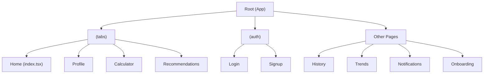
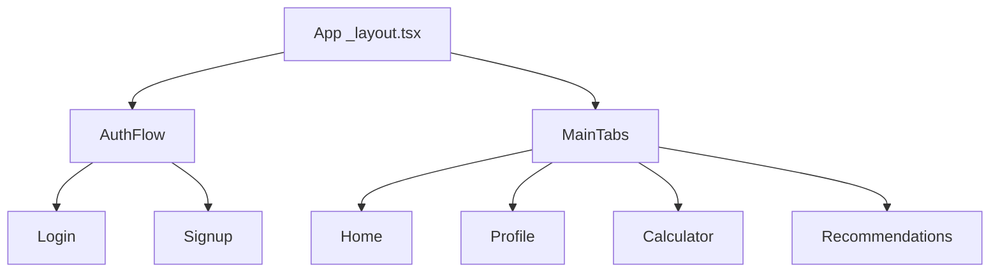
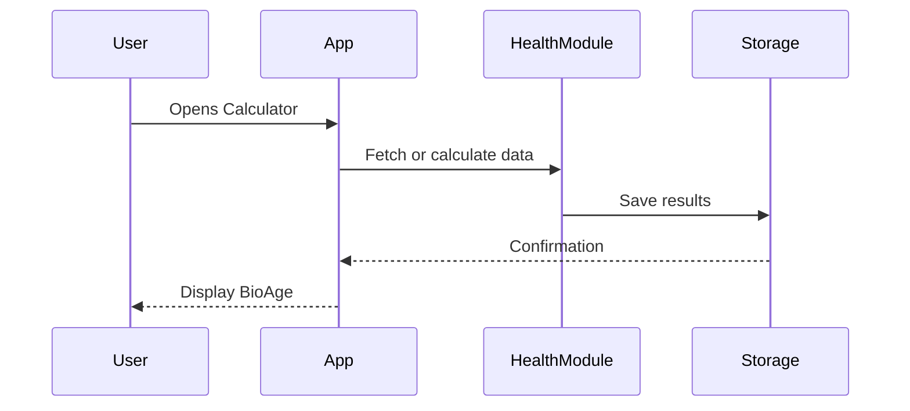
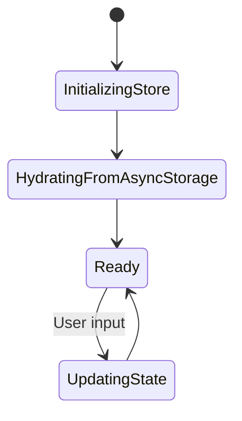
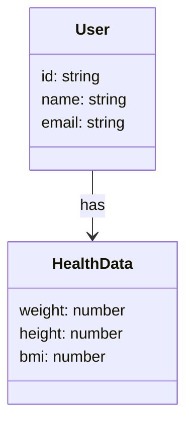

# 📱 BioAge App - Mermaid Codebase Map

## 📁 Folder Structure

---

## 🧭 Navigation Flow

---

## 🔁 Health Data Calculation (Example Flow)

---

## 🧠 Zustand State Flow (if applicable)

---

## 📐 Data Models (Based on `types/user.ts` and `types/health.ts`)

